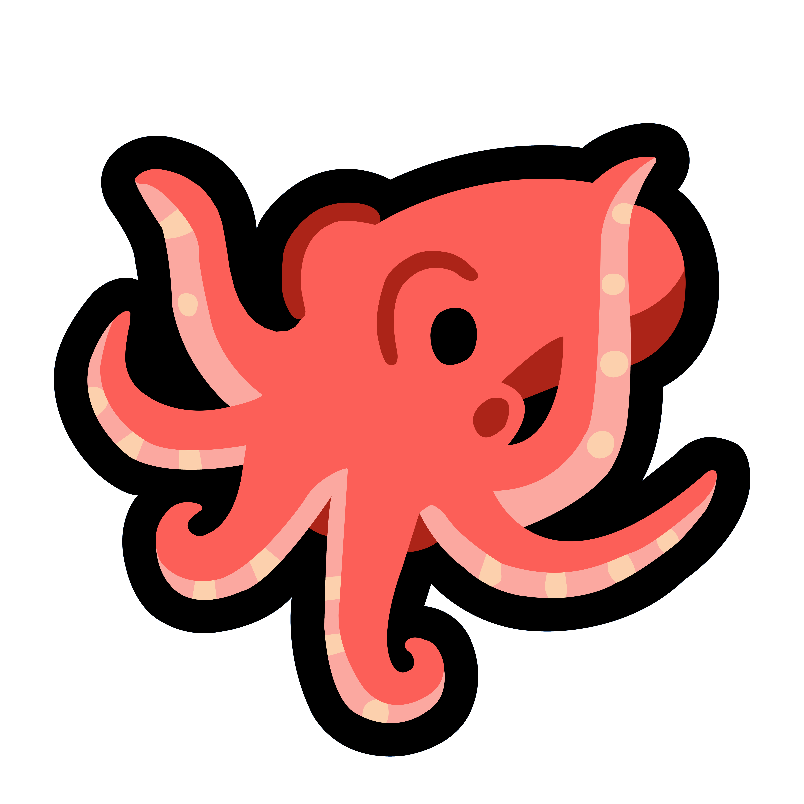

<p align="center">
    <a href="https://discord.com/api/oauth2/authorize?client_id=911101278388641873&permissions=0&scope=bot%20applications.commands">
        
    </a>
</p>

# Otto

> A friendly, music-playing cephalopod.

- YouTube and Spotify support
- Beautiful embeds
- Slash commands

## Getting Started
**Node.js 16.9.0 or newer is required.**

- Set up required environment variables (See .env.example)

```
npm install
npm run build
npm start
```

### Docker
```
docker build ./ -t otto
docker run -d otto
```

## License
MIT
